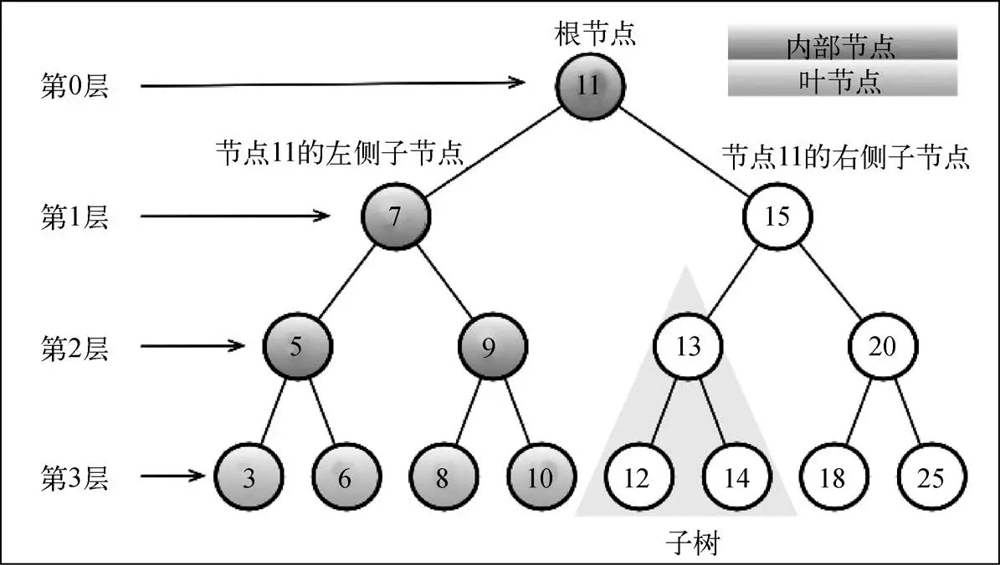

# JavaScript数据结构

## 数组

### 数组实现

1. 创建和初始化数组

```js
var daysOfWeek=[];
daysOfWeek=['Sunday', 'Monday', 'Tuesday', 'Wednesday','Thursday', 'Friday', 'Saturday'];
```

2. 访问和迭代数组

```js
for (var i=0;i<daysOfWeek.length;i++){
    console.log(daysOfWeek[i]);
}
```

3. 添加元素

```js
//尾添加
numbers.push(12, 13);
//or
numbers[numbers.length]=10;
//首添加
numbers.unshift(-4, -3);
//or
for(var i=numbers.length;i>0;i--){
    numbers[i]=numbers[i-1];
}
numbers[0]=-1;
```

4. 删除元素

```js
//尾删除
numbers.pop();
//or
numbers.length=numbers.length-1;
//首删除
numbers.shift();
//or
for(var i=0;i<numbers.length;i++){
    numbers[i]=numbers[i+1];
}
numbers.length=numbers.length-1;
```

5. 在任意位置添加和删除元素

```js
//添加
numbers.splice(5,0,2,3,4);
//删除
numbers.splice(5,3);
```

### JavaScript数组的其他方法

 1. 数组合并

 ```js
 var zero=0;
 var positiveNumbers=[1,2,3];
 var negativeNumbers=[-3,-2,-1];
 var numbers=negativeNumbers.concat(zero, positiveNumbers);
 ```

 2. 迭代器函数

 ```js
 var isEven=function(item){
    return (x%2==0)?true:false;
 }
 //every，每一项返回true时，整体返回true
 numbers.every(isEven);
 //some，任意一项返回true，整体返回true
 numbers.some(isEven);
 //filter，整体返回由返回值为true的项组成的数组
 var evenNumbers=numbers.filter(isEven);
 //map，整体返回由返回值组成的数组
 var myMap=numbers.map(isEven);
 //reduce，整体返回叠加的值
 numbers.reduce(function(previous, current, index){
    return previous + current;
 });
 //forEach，对数组每一项执行传入函数
 numbers.forEach(function(x){
    console.log((x % 2 == 0));
 });
 ```

***

## 栈（LIFO）

### 栈实现

```js
function Stack(){
    let items=[];
    //向栈添加元素
    this.push=function(element){
        items.push(element);
    };
    //从栈移除元素
    this.pop=function(){
        return items.pop();
    };
    //查看栈顶元素
    this.peek=function(){
        return items[items.length-1];
    };
    //检查栈是否为空
    this.isEmpty=function(){
        return items.length==0;
    };
    this.size=function(){
        return items.length;
    };
    //清空和打印栈元素
    this.clear=function(){
        items=[];
    };
    this.print=function(){
        console.log(items.toString());
    };
}
//使用Stack类
let stack=new Stack();
```

### ECMAScript 6 实现Stack 类

1. ES6声明Stack类

```js
class Stack{
    constructor(){
        this.items=[];
    }
    push(element){
        this.items.push(element);
    }
    //其他方法
}
```

***

## 队列（FIFO）

### 队列实现

```js
function Queue(){
    let items=[];
    //向队列添加元素
    this.enqueue=function(element){
        items.push(element);
    };
    //从队列移除元素
    this.dequeue=function(){
        return items.shift();
    };
    //查看队列头元素
    this.front=function(){
        return items[0];
    };
    //检查队列是否为空
    this.isEmpty=function(){
        return items.length == 0;
    };
    this.size=function(){
        return items.length;
    };
    //打印队列元素
    this.print=function(){
        console.log(items.toString());
    };
}
//使用Queue类
let queue=new Queue();
```

***

## 链表

**数组的缺点：**

1. 大小固定
2. 移动数据成本高
3. 数据存储需要连续的空间

**链表的缺点：**

1. 获取数据成本高

### 实现单向链表

```js
function LinkedList(){
    //节点类
    let Node=function(element){
        this.element=element;
        this.next=null;
    };
    let length=0;
    let head=null;
    this.append=function(element){
        let node=new Node(element);
        let current;
        //空链表
        if(head===null){
            head=node;
        }else{
            current=head;
            while(current.next){
                current=current.next;
            }
            current.next=node;
        }
        length++;
    };
    this.insert=function(position,element){
        //检查越界
        if(position>=0&&position<=length){
            let node=new Node(element);
            let current=head;
            let previous;
            let index=0;
            if(position===0){
                node.next=current;
                head=node;
            }else{
                while(index<position){
                    previous=current;
                    current=current.next;
                    index++;
                }
                node.next=current;
                previous.next=node;
            }
            length++;
            return true;
        }else{
            return false;
        }
    };
    this.removeAt=function(position){
        //检查越界
        if(position>=0&&position<length){
            let current=head;
            let previous;
            index=0;
            if(position===0){
                head=current.next;
            }else{
                while(index<position){
                    previous=current;
                    current=current.next;
                    index++;
                }
                previous.next=current.next;
            }
            length--;
            return current.element;
        }else{
            return null;
        }
    };
    this.indexOf=function(element){
        let current=head;
        let index=0;
        while(current){
            if(element===current.element){
                return index;
            }
            index++;
            current=current.next;
        }
        return -1;
    };
    this.remove=function(element){
        let index=this.indexOf(element);
        return this.removeAt(index);
    };
    this.toString=function(){
        let current=head;
        let string='';
        while(current){
            string+=current.element+(current.next?'n':'');
            current=current.next;
        }
        return string;
    };
    this.isEmpty=function(){
        return length===0;
    };
    this.size=function(){
        return length;
    };
    this.getHead=function(){
        return head;
    };
}
```

### 实现双向链表

```js
function DoublyLinkedList(){
    let Node=function(element){
        this.element=element;
        this.next=null;
        this.prev=null;
    };
    let length=0;
    let head=null;
    let tail=null;
    this.insert=function(position,element){
        //检查越界
        if(position>=0&&position<=length){
            let node=new Node(element);
            let current=head;
            let previous;
            let index=0;
            if(position===0){
                if(!head){
                    head=node;
                    tail=node;
                }else{
                    node.next=current;
                    current.prev=node;
                    head=node;
                }
            }else if(position===length){
                current=tail;
                current.next=node;
                node.prev=current;
                tail=node;
            }else{
                while(index<position){
                    previous=current;
                    current=current.next;
                    index++;
                }
                node.next=current;
                current.prev=node;
                previous.next=node;
                node.prev=previous;
            }
            length++;
            return true;
        }else{
            return false;
        }
    };
    this.removeAt=function(position){
        if(position>=0&&position<length){
            let current=head;
            let previous;
            let index=0;
            if(position===0){
                head=current.next;
                if(length===1){
                    tail=null;
                }else{
                    head.prev=null;
                }
            }else if(position===length-1){
                current=tail;
                tail=current.prev;
                tail.next=null;
            }else{
                while(index<position){
                    previous=current;
                    current=current.next;
                    index++;
                }
                previous.next=current.next;
                current.next.prev=previous;
            }
            length--;
            return current.element;
        }else{
            return null;
        }
    }
}
```

***

## 集合

**集合**是由一组无序且唯一（即不能重复）的项组成的，ECMAScript 6原生支持Set类

### 集合实现

```js
function Set(){
    let items={};
    this.has=function(value){
        return value in items;
    };
    this.add=function(value){
        if(!this.has(value)){
            items[value]=value;
            return true;
        }
        return false;
    };
    this.remove=function(value){
        if(this.has(value)){
            delete items[value];
            return true;
        }
        return false;
    };
    this.clear=function(){
        items={};
    };
    this.size=function(){
        return Object.keys(items).length;
    };
    this.values=function(){
        let values=[];
        for(let i=0,keys=Object.keys(items);i<keys.length;i++){
            values.push(items[keys[i]]);
        }
        return values;
    }
}
//使用Set类
let set=new Set();
```

### 实现集合操作

1. 并集

```js
function Set(){
    //其他实现代码

    //Set类的union方法
    this.union=function(otherSet){
        let unionSet=new Set();
        let values=this.values();
        for(let i=0;i<values.length;i++){
            unionSet.add(values[i]);
        }
        values=otherSet.values();
        for(let i=0;i<values.length;i++){
            unionSet.add(values[i]);
        }
        return unionSet;
    }
}
```

2. 交集

```js
function Set(){
    //其他实现代码

    this.intersection=function(otherSet){
        let intersectionSet=new Set();
        let values=this.values();
        for(let i=0;i<values.length;i++){
            if(otherSet.has(values[i])){
                intersectionSet.add(values[i]);
            }
        }
        return intersectionSet;
    }
}
```

3. 差集

```js
function Set(){
    //其他实现代码

    this.difference=function(otherSet){
        let differenceSet=new Set();
        let values=this.values();
        for(i=0;i<values.length;i++){
            if(otherSet.has(values[i])){
                differenceSet.add(values[i]);
            }
        }
        return differenceSet;
    }
}
```

4. 子集

```js
function Set(){
    //其他实现代码

    this.subset=function(otherSet){
        if(this.size()>otherSet.size()){
            return false;
        }else{
            let values=this.values();
            for(let i=0;i<values.length;i++){
                if(!otherSet.has(values[i])){
                    return false;
                }
            }
            return true;
        }
    }
}
```

***

## 字典和散列表

**字典**和集合很相似，集合以[值，值]的形式存储元素，字
典则是以[键，值]的形式来存储元素。字典也称作映射，字典的键是唯一的

### 字典实现

```js
function Dictionary(){
    let items={};
    this.has=function(key){
        return key in items;
    };
    this.set=function(key,value){
        items[key]=value;
    };
    this.delete=function(key){
        if(this.has(key)){
            delete items[key];
            return true;
        }
        return false;
    };
    this.get=function(key){
        return this.has(key)?items[key]:undefined;
    };
    this.values=function(){
        let values=[];
        for(let key in items){
            values.push(items[key]);
        }
        return values;
    };
    this.keys=function(){
        return Object.keys(items);
    };
    this.getItems=function(){
        return items;
    };
}
//使用Dictionary 类
let dictionary=new Dictionary();
```

**散列映射**和字典一样键是唯一的，散列映射的键对应的散列值代表实际值在散列表中的地址
散列函数：键值经过散列函数得到散列值

### 散列表实现

```js
function HashTable(){
    let table=[];
    //散列函数
    let loseloseHashCode=function(key){
        let hash=0;
        for(let i=0;i<key.length;i++){
            hash+=key.charCodeAt(i);
        }
        return hash%37;
    };
    this.put=function(key,value){
        let position=loseloseHashCode(key);
        console.log(position+' - '+key);
        table[position]=value;
    };
    this.get=function(key){
        return table[loseloseHashCode(key)];
    };
    this.remove=function(key){
        table[loseloseHashCode(key)]=undefined;
    };
}
//使用 HashTable 类
let hash=new HashTable();
```

**散列集合**和集合一样值是唯一的，散列的值对应的散列值代表实际值在散列表中的地址
散列函数：实际值经过散列函数得到散列值
***

## 树

**树**和散列映射一样是非顺序数据结构，对于存储需要快速查找的数据非常有用


- 位于树顶部的节点叫作根节点（11）。它没有父节点。树中的每个元素都叫作节点，节点分
为内部节点和外部节点。至少有一个子节点的节点称为内部节点（7、5、9、15、13和20是内部
节点）。没有子元素的节点称为外部节点或叶节点（3、6、8、10、12、14、18和25是叶节点）
- 一个节点可以有祖先和后代。一个节点（除了根节点）的祖先包括父节点、祖父节点、曾祖
父节点等。一个节点的后代包括子节点、孙子节点、曾孙节点等。例如，节点5的祖先有节点7
和节点11，后代有节点3和节点6
- 有关树的另一个术语是子树。子树由节点和它的后代构成。例如，节点13、12和14构成了上
图中树的一棵子树
- 节点的一个属性是深度，节点的深度取决于它的祖先节点的数量。比如，节点3有3个祖先节
点（5、7和11），它的深度为3
- 树的高度取决于所有节点深度的最大值。一棵树也可以被分解成层级。根节点在第0层，它
的子节点在第1层，以此类推。上图中的树的高度为3（最大高度已在图中表示——第3层）

**二叉树和二叉搜索树**
二叉树中的节点最多只能有两个子节点：一个是左侧子节点，另一个是右侧子节点。
二叉搜索树（BST）是二叉树的一种，但是它只允许你在左侧节点存储（比父节点）小的值，
在右侧节点存储（比父节点）大（或者等于）的值

### 实现二叉搜索树

```js
function BinarySearchTree(){
    let Node=function(key){
        this.key=key;
        this.left=null;
        this.right=null;
    };
    let root=null;
    //插入节点方法
    this.insert=function(key){
        let newNode=new Node(key);
        if(root===null){
            root=newNode;
        }else{
            insertNode(root.newNode);
        }
    };
    //插入节点辅助函数
    let insertNode=function(node,newNode){
        if(newNode.key<node.key){
            if(node.left===null){
                node.left=newNode;
            }else{
                insertNode(node.left,newNode);
            }
        }else{
            if(node.right===null){
                node.right=newNode;
            }else{
                insertNode(node.right,newNode);
            }
        }
    };
    //树的遍历-中序遍历
    this.inOrderTraverse=function(callback){
        inOrderTraverseNode(root,callback);
    };
    let inOrderTraverseNode=function(node,callback){
        if(node!==null){
            inOrderTraverseNode(node.left,callback);
            callback(node.key);
            inOrderTraverseNode(node.right,callback);
        }
    };
    //树的遍历-先序遍历
    this.preOrderTraverse=function(callback){
        preOrderTraverseNode(root,callback);
    };
    let preOrderTraverseNode=function(node,callback){
        if(node!==null){
            callback(node.key);
            preOrderTraverseNode(node.left,callback);
            preOrderTraverseNode(node.right,callback);
        }
    };
    //树的遍历-后序遍历
    this.postOrderTraverse=function(callback){
        postOrderTraverseNode(root,callback);
    };
    let postOrderTraverseNode=function(node,callback){
        if(node!==null){
            postOrderTraverseNode(node.left,callback);
            postOrderTraverseNode(node.right,callback);
            callback(node.key);
        }
    };
    //搜索树中的值
    //搜索最小值
    this.min=function(){
        return minNode(root);
    };
    let minNode=function(node){
        if(node){
            while(node&&node.left!==null){
                node=node.left;
            }
            return node.key;
        }
        return null;
    };
    //搜索最大值
    this.max=function(){
        return maxNode(root);
    };
    let maxNode=function(node){
        if(node){
            while(node&&node.right!==null){
                node=node.right;
            }
            return node.key;
        }
        return null;
    };
    //搜索特定值
    this.search=function(key){
        return searchNode(root,key);
    };
    let searchNode=function(node,key){
        if(node===null){
            return false;
        }
        if(key<node.key){
            return searchNode(node.left,key);
        }else if(key>node.key){
            return searchNode(node.right,key);
        }else{
            return true;
        }
    };
    //移除节点
    this.remove=function(key){
        root=removeNode(root,key);
    };
    let removeNode=function(node,key){
        if(node==null){
            return null;
        }
        if(key<node.key){
            node.left=removeNode(node.left,key);
            return node;
        }else if(key>node.key){
            node.right=removeNode(node.right,key);
            return node;
        }else{
            if(node.left===null&&node.right===null){
                node=null;
                return node;
            }
            if(node.left===null){
                node=node.right;
                return node;
            }else if(node.right===null){
                node=node.right;
                return node;
            }
            let aux=findMinNode(node.right);
            node.key=aux.key;
            node.right=removeNode(node.right,aux.key);
            return node;
        }
    };
    let findMinNode=function(node){
        while(node&&node.left!==null){
            node=node.left;
        }
        return node;
    };
    
}
let tree=new BinarySearchTree();
function printNode(value){
    console.log(value);
}
//调用中序遍历
tree.inOrderTraverse(printNode);
//调用先序遍历
tree.preOrderTraverse(printNode);
//调用后序遍历
tree.postOrderTraverse(printNode);
```

<!-- ## 图
图是一种非线性数据结构 -->