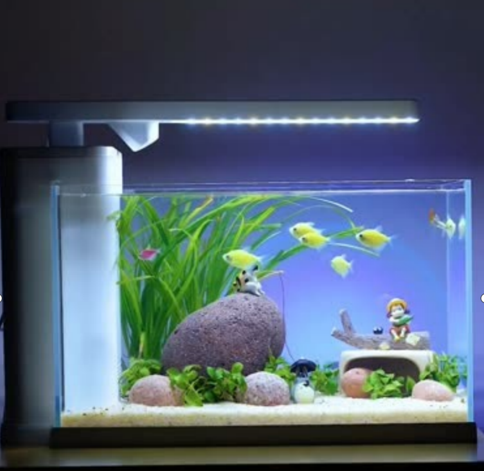
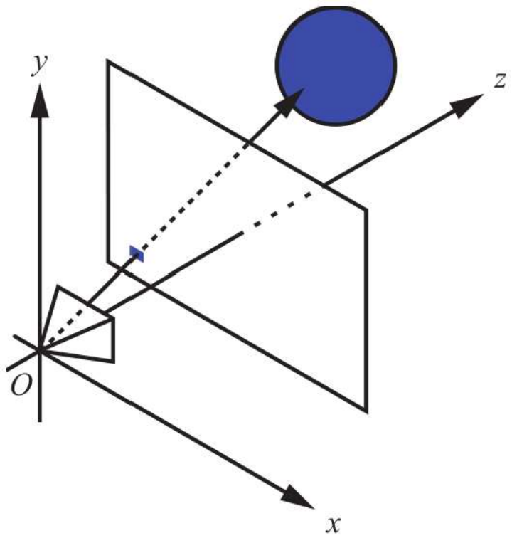
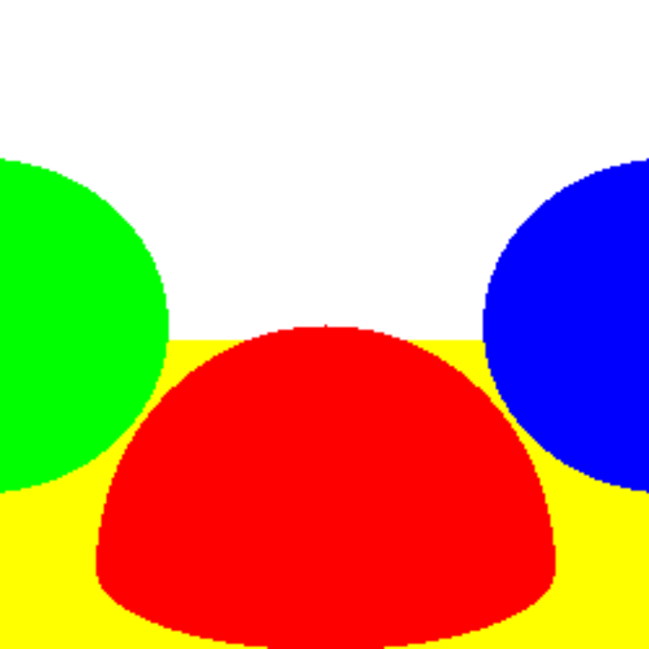
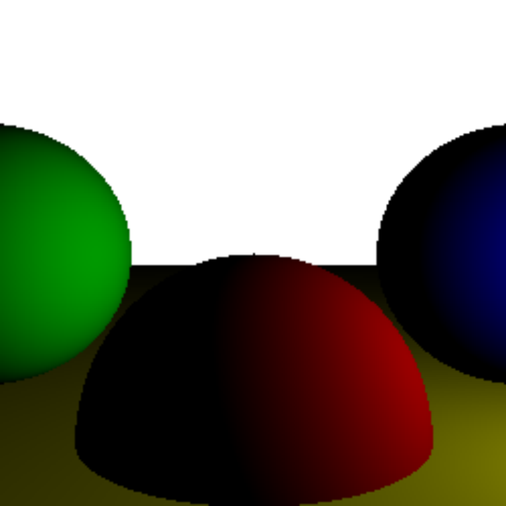
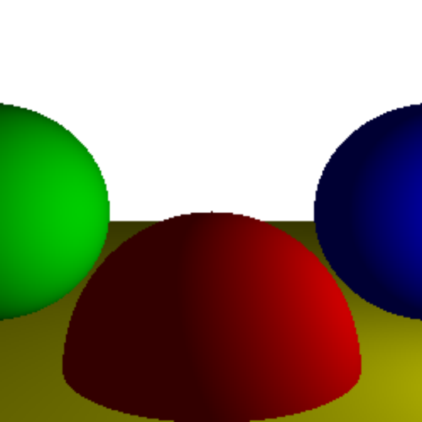
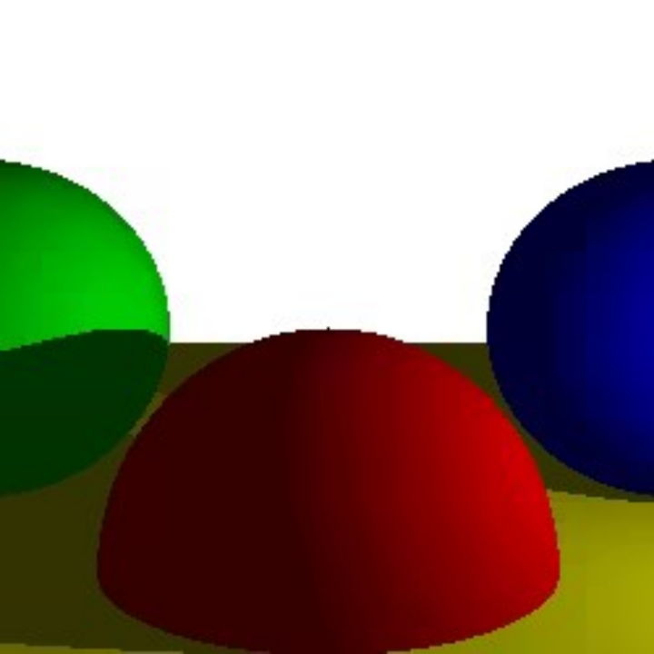
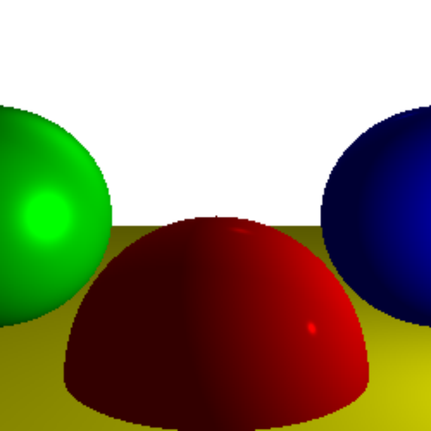
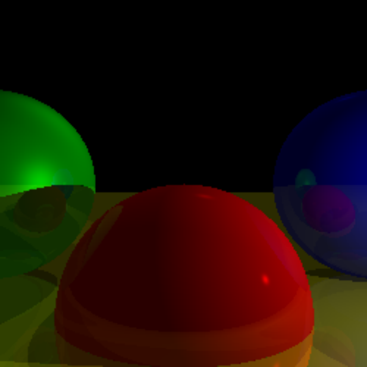

# 什么是光线追踪算法

## 什么是图形学

图形学是研究如何利用计算机来生成、处理和显示图像的学科领域，图形学主要关注如何通过算法和技术来实现各种图像效果。比如平移、旋转、缩放、阴影、雾化、镜面等等

## web前端与图形学

- 技术：img、svg、canvas、webgl、three.js、text?
- 应用：游戏、设计、AR/VR、智能驾驶、图像识别、[Google Earth](https://earth.google.com/web/)

## 三维场景的基本元素

1. 相机
2. 场景
3. 光源
4. 物体（人物）

## 基础的光源类型

1. 环境光
2. 平行光
3. 点光源
4. ~~聚光灯~~

## 光栅与光追

1. [光栅与光追画面对比](https://club.gamersky.com/activity/447066?club=54)
2. 光线追踪产生的画面更逼真和精细，但计算成本较高。而光栅化适用于实时渲染的场景，虽然画面效果可能不如光线追踪，但能够实现高帧率的交互效果
3. 光追的逻辑更简单，更容易理解

## 光线追踪

### 图中包含哪些光源，物体和材质？

### 正向追踪

根据成像理论，包含所有颜色的光线，在环境中被物体表面吸收、反射、折射最终进入人眼，被视锥细胞感知，跟相机成像相同
光子追踪技术：假设有一个点光源，向周围发射白色光子，实时计算光子的运动轨迹，并计算与每个物体的作用结果，将最终到达视野的光的颜色记录下来

以上的方法会有什么问题？如何解决？
一个100W的灯泡，每秒会发出10的20次方个光子，需要消耗大量的计算资源，并且绝大部分的光子并不会进入视野中

### 反向追踪

假设你想将一个风景画下来。你可以在你面前放一个方框，然后方框上用很多的细线分割成一个个小格子，然后固定你的视线，依次观察每个小格子里面的颜色，然后将它绘制在你画布同样的位置上，一幅画就完成了
为了避免光子追踪的性能浪费，逆向思维，从眼睛向方框的某一点发射一条射线，射线与场景中的某个物体相交，用物体的颜色属性作为该点的颜色

以上的方法会有什么问题？如何解决？

为了解决没有立体感的问题，我们向场景中添加一个点光源或者平行光，为了计算光对物体表面的影响，我们依旧需要追踪光子，但是此时只需要计算能到达相交点的光子即可

以上的方法会有什么问题？如何解决？
光子不能到达的地方会呈现完全黑暗。因为没有考虑光子折射的影响，如果考虑折射，那就又是光子追踪了。为了简化，我们将所有折射的影响统一为环境光，一个基础底色
根据以上理论。考虑物体本来的颜色再加上环境光再加上点光和平行光对相交点颜色的影响，即可得到该点正确的颜色值，然后返回

以上的方法会有什么问题？如何解决？
没有考虑阴影，有些区域，光线并不能到达，所以需要忽略光源对该点的贡献，从相交点向光源方向发射射线，如果与物体相交，则忽略该光源的影响

### 性能优化

1. 多线程：由于场景中的数据是只读的且每条检测射线之间互不干扰，所以可以多线程并行进行颜色检查
2. 阴影相干性：如果一个点在阴影中，那么它相邻的点也很有可能在阴影中，当知道A点被物体B遮挡，那么当判定A+点时，可以优先判断与物体B是否有交点，然后再去判断其他物体
3. 分层检测：如果几个物体靠得很近，可以用一个最小球体将它们包裹在内，如果射线不与这个球体相交，那么就不用再检测射线与内部物体的相交性了，包围球内部也可以有包围球
4. 子采样：如果A点射线与物体B相交，A+2也与B相交，那么我们可以假设A+1也与物体B相交，直接计算该点颜色。在水平和垂直方向都每隔一个像素跳过一个像素的相交检查，最多节省75%的性能。可能会错过宽度为1像素的物体，因为A和A+2都不与物体相交

### 思考

1. 为什么现实中越远的物体越模糊？如何实现雾化效果？
2. 如何实现哑光和亮光效果？
3. 如何实现镜子的效果？镜中镜又该如何实现？
4. 如果实现透视的效？

## 参考

1. [计算机图形学入门 : 3D渲染指南](https://book.douban.com/subject/35894599/)

## 在线实例

1. [读[计算机图形学入门-3D渲染指南练习]所做练习](https://zhoulhcn.github.io/#/micro-vue-route/lab/09-webgl-graph)
