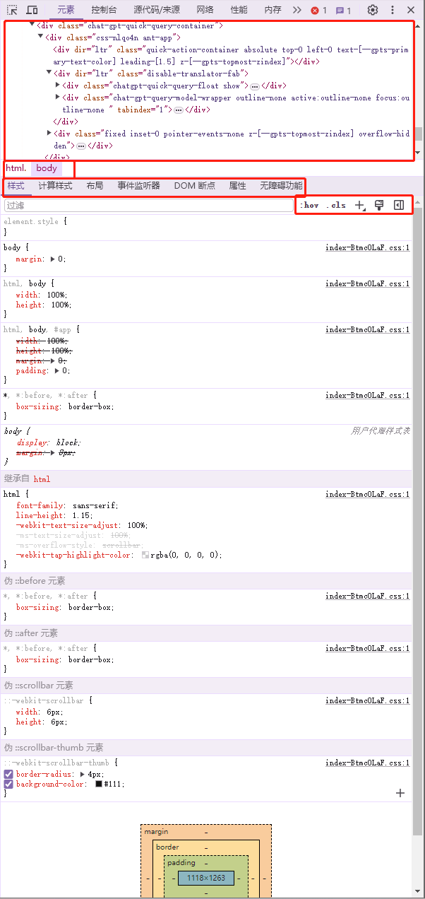
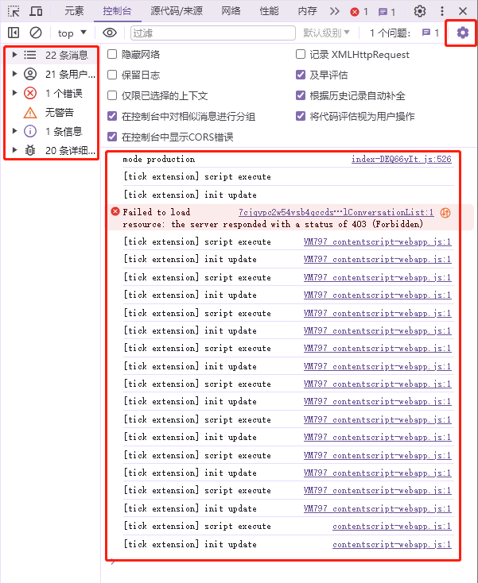
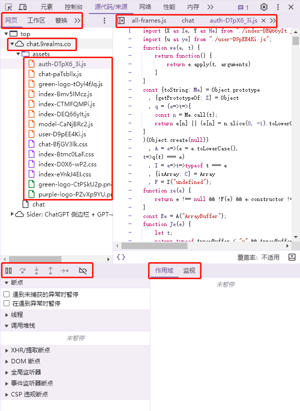
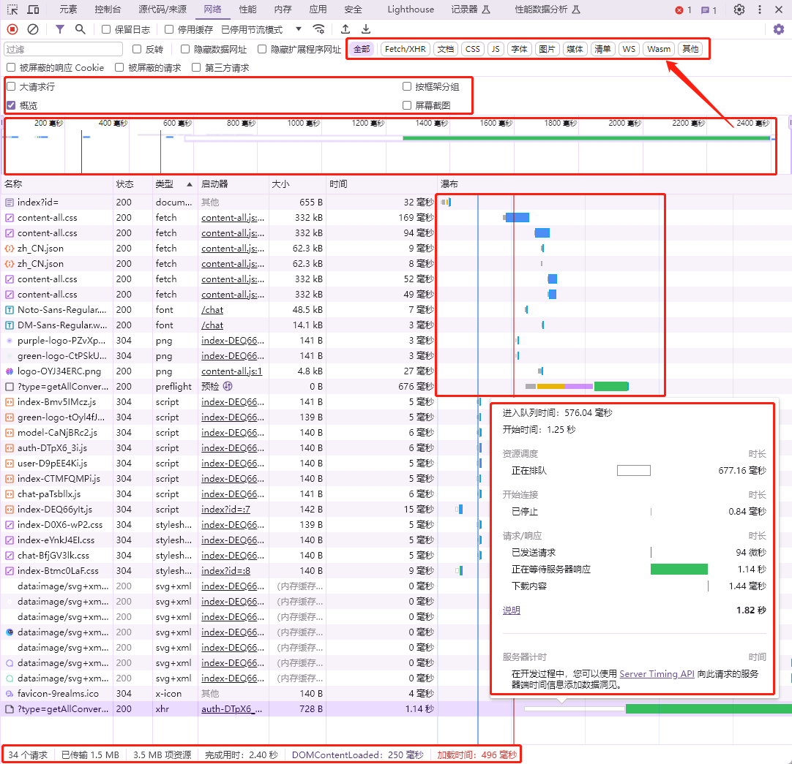
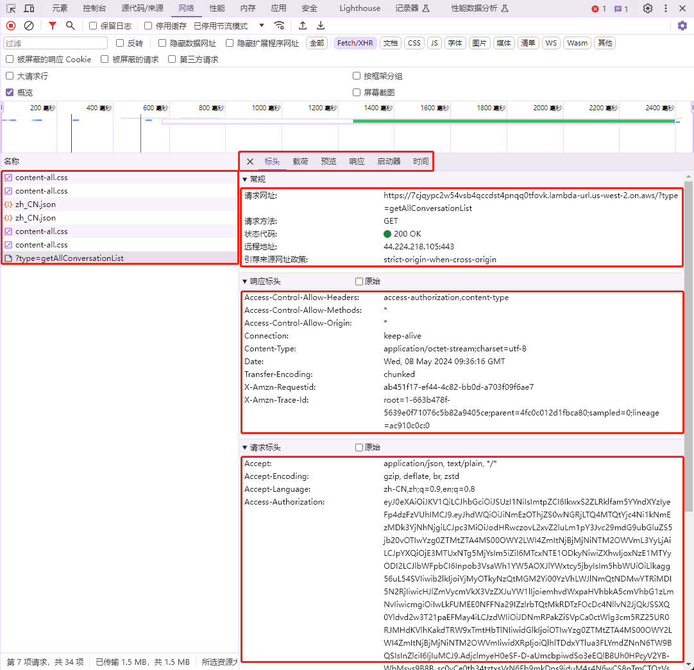
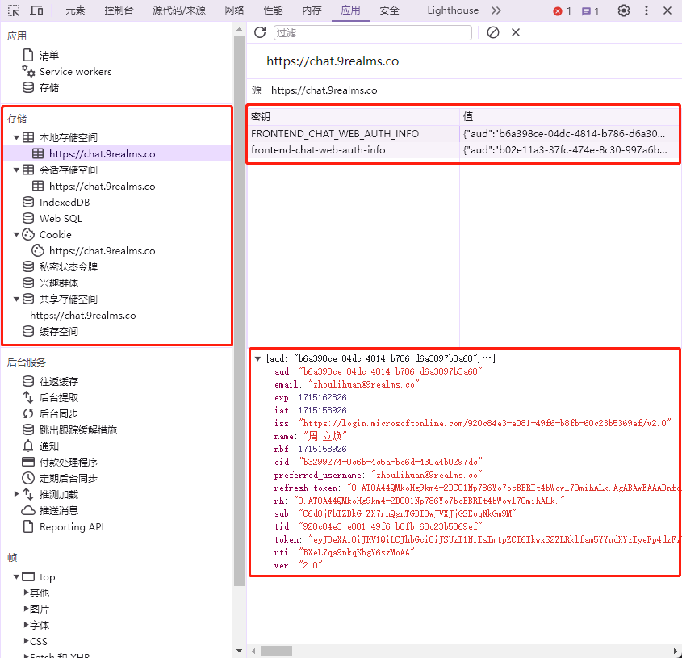
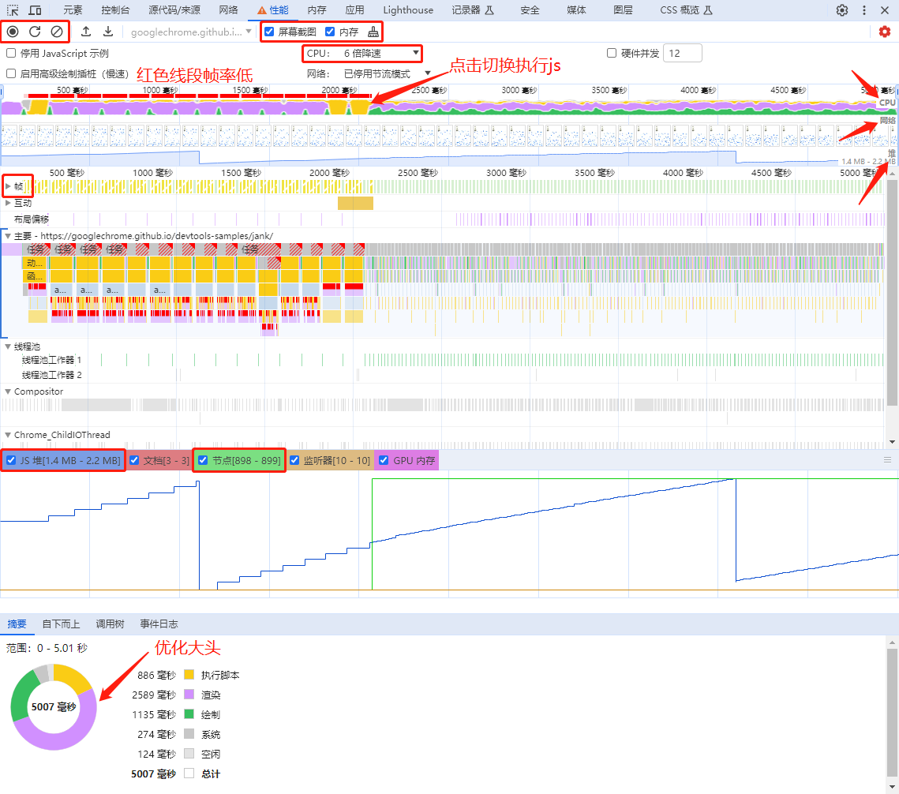
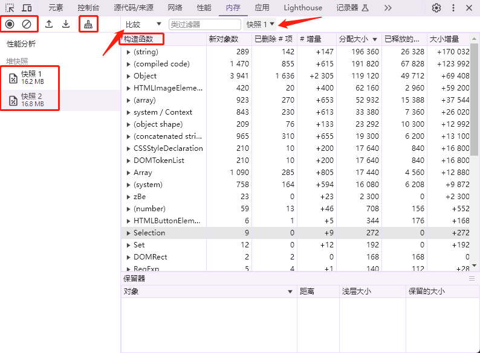
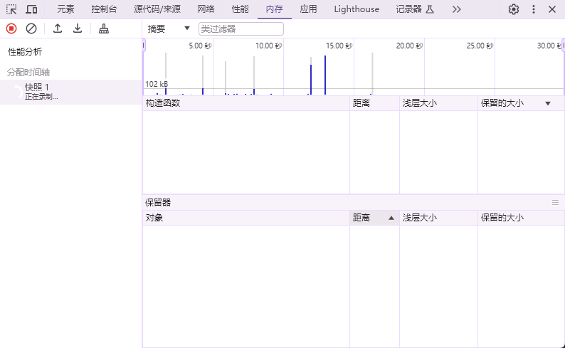
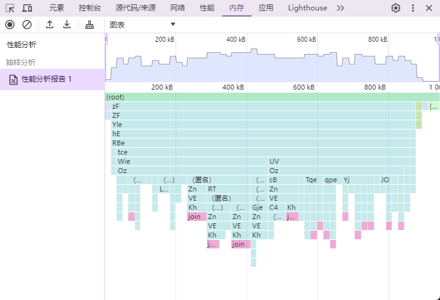

# 前端性能优化和性能问题排查

## 工具

1. [Chrome DevTools文档](https://developer.chrome.com/docs/devtools/overview?hl=zh-cn)：Chrome DevTools是Google Chrome浏览器内置的一组开发者工具，用于帮助开发人员调试、测试和优化网页和应用程序
2. Lighthouse：Lighthouse是一个由Google开发的开源工具，用于评估网页性能和质量
3. FCP(首次内容绘制)：FCP就是用户可以看到页面的某个部分发生变化的时刻
4. 性能问题主要从显卡、CPU、内存、网络四个方面来分析
5. 《web性能权威指南》
6. 正常情况下，在页面缓存数据量不变的情况下，内存的使用量应该是偶尔波动，但最终回归到一个稳定的值。如果内存使用量持续增长，说明页面存在内存泄漏
7. 标签页显示的内存有滞后性，以Chrome DevTools中的内存面板为准
8. 垃圾(内存)回收时，所有脚本都会暂停执行，所以如果垃圾回收频繁，也会导致页面卡顿
9. 把内存问题分为两大类，一是瞬时内存过高，二是泄漏，泄漏一般情况下不会太明显，瞬时有可能是vue转换了firebase中的引用类型
10. 性能可以录制加载过程或者后续操作，分析加载过程中占比较高的操作，找出性能瓶颈
11. Whistle：网络代理工具，对于不能直接连接生产环境，发版不方便时比较有用，可以直接修改生产的前端代码方便定位问题

## 新页面长时间白屏

1. 浏览器有最大并发请求限制，超过限制数目的请求会被阻塞，直到前面的请求返回，才能继续发起请求。如果页面存在大量的请求或者一个请求的数据量过大，就会长时间占用请求限额，导致新开页面长时间白屏
2. 如果是Nuxt项目，因为Nuxt需要先完成plugin的初始化，才会进行页面的渲染，如果plugin中存在被阻塞的请求，就会导致页面长时间白屏

## 喔唷 崩溃啦 错误代码 5 (Aw, Snap!)

1. 浏览器存在内存限制，内存泄漏或者内存溢出会导致浏览器崩溃

## 页面卡顿(丢帧)

1. 浏览器包括js线程和GUI线程，而二者是互斥的，当长时间占用js线程时(计算等)，会导致渲染不及时，出现页面卡顿
2. 内存占用过高，会导致数据交换频繁(少量多次)从而导致CPU效率低下，出现页面卡顿
3. 页面回流和重绘太频繁
4. 显示器帧率过高或者画面过于复杂精细，GPU渲染时间过长，导致页面卡顿，比如动态的Canvas画面
5. DOM节点过多，导致页面渲染时间过长，出现页面卡顿

## 响应慢

1. 接口响应慢、网速较慢、请求资源过大，导致页面加载时间过长。可通过分页、懒加载、loading动画等方式优化

## Chrome DevTools - Performance

- 主要用于记录和分析网页加载过程中不同事件所消耗的时间
- 可以查看页面加载各个阶段的时间线,找出性能瓶颈
- 分析JavaScript脚本执行时间
- 检查渲染性能问题，如布局和重绘等
- 侧重于时间性能分析

## Chrome DevTools - Memory

- 专注于JavaScript内存使用情况的分析
- 可以检测内存泄漏问题
- 跟踪内存占用随时间的变化趋势
- 分析内存中的对象占用情况
- 查找保持对大对象或多余对象的长期引用
- 侧重于内存使用情况分析

## 内存溢出

1. 全量拉取数据到前端，然后进行format和filter，可能导致瞬间内存占用过高，从而导致内存溢出

## 内存泄漏

1. 闭包：内层函数引用了外层函数的变量，导致外层函数的变量无法被回收
2. 全局变量：全局变量一直存在于内存中，不会被回收
3. 控制台打印，打印的变量会一直存在于内存中，直到页面刷新
4. 未清除的定时器，定时器要及时清除，尤其是有闭包的情况下
5. 分离的DOM节点，`const node = document.querySelector('#tag')`，只要node存在，node和node的父节点即使被移除，也不会被回收

## Chrome DevTools-工具概览

### 元素

### 控制台

### 源代码+来源

### 网络

### 应用

### Lighthouse

### 性能

1. [Chrome DevTools/Performance](https://developer.chrome.com/docs/devtools/performance?hl=zh-cn)
2. 通过录制页面一段时间的操作，通过底部的JS堆、节点等的前后变化，来快速定位内存泄漏问题
3. 内存主要关注JS堆、节点和事件监听器

### 内存

### 其他

1. [Chrome DevTools/Memory](https://developer.chrome.com/docs/devtools/memory?hl=zh-cn)
2. 可以通过`window.performance.memory`查看单个Tab内存限制和使用情况
3. 字节 -> GB: `window.performance.memory.x / 1024 / 1024 / 1024`
4. 单个Tab内存限制一般为1.8GB左右，超出内存->Aw, Snap!
5. Chrome可以将鼠标悬浮在Tab上查看内存使用情况
