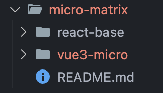

# 微前端升级记录

## 背景

1. 我决定将个人主要使用的前端框架从Vue/Vue3变更为React，决策原因看[这里的分析总结](https://zhoulhcn.github.io/#/micro-vue-route/blog/blog-detail?id=5)
2. 但是个人网站之前是基于Vue3实现的，为了尽可能的减少改动，决定使用微前端升级个人网站，网站旧有实现仍然使用Vue3，新的页面将使用React18做实现
3. React18作为主应用，Vue3作为子应用

## 目录结构



## 主应用接入qiankun

### 主应用-安装

```js
npm install qiankun
```

### 修改src/index.tsx

```js
import React from "react";
import ReactDOM from "react-dom/client";
import App from "./App";
import { registerMicroApps, start } from "qiankun";
import { HashRouter as Router } from "react-router-dom";

const root = ReactDOM.createRoot(
  document.querySelector("#main-root") as HTMLElement
);
root.render(
  <React.StrictMode>
    <Router>
      <App />
    </Router>
  </React.StrictMode>
);

const isProd = process.env.NODE_ENV === "production";
registerMicroApps(
  [
    {
      name: "micro-v-app",
      entry: isProd ? "/micro-v-dist/" : "//localhost:3001",
      container: "#micro-app",
      activeRule: "#/micro-vue-route",
    },
  ],
  {
    beforeLoad: [
      (app) => {
        console.log("before main load", app);
        return Promise.resolve();
      },
    ],
    beforeMount: [
      (app) => {
        console.log("before main mount", app);
        return Promise.resolve();
      },
    ],
    afterMount: [
      (app) => {
        console.log("after main mount", app);
        return Promise.resolve();
      },
    ],
    beforeUnmount: [
      (app) => {
        console.log("before main unload", app);
        return Promise.resolve();
      },
    ],
    afterUnmount: [
      (app) => {
        console.log("after main unload", app);
        return Promise.resolve();
      },
    ],
  }
);

start();
```

## 子应用接入qiankun

### 子应用-安装

```js
npm install qiankun
```

### 修改src/main.ts

```js
import { createApp } from 'vue'
import { createPinia } from 'pinia'
import App from './App.vue'
import router from './router'
import Icon from '@/components/global/Icon.vue'
import Antd from 'ant-design-vue'
import '@/router/permission'
import 'ant-design-vue/dist/reset.css'
import './assets/styles/main.less'
import { Image, Viewer } from 'vue3-image-viewer'
import 'vue3-image-viewer/dist/style.css'
import { createGlobalDirective } from '@/directives/index'
import { messages, LangKeyEnum } from '@/locales';
import { renderWithQiankun, qiankunWindow } from 'vite-plugin-qiankun/dist/helper';

// 国际化
import { createI18n } from 'vue-i18n'
const i18n = createI18n({
  legacy: false,
  locale: LangKeyEnum.ZH_CN,
  fallbackLocale: 'en',
  messages
})
Object.defineProperty(globalThis, 'CESIUM_BASE_URL', {
  value: "/node_modules/cesium/Build/Cesium"
})

let app: any = null;
function initialApp() {
  app = createApp(App)
  app.use(createPinia())
  app.use(router)
  app.use(Antd)
  app.use(i18n)
  app.component('Icon', Icon)
  app.component('Image', Image)
  app.component('Viewer', Viewer)
  createGlobalDirective(app)
}


if (!qiankunWindow.__POWERED_BY_QIANKUN__) {
  initialApp()
  app.mount('#sub-vue')
} else {
  renderWithQiankun({
    mount(props) {
      console.log('micro vue mount')
      initialApp()
      app.mount(props.container.querySelector('#sub-vue'));
    },
    bootstrap() {
      console.log('micro vue bootstrap')
    },
    update() {
      console.log('micro vue update')
    },
    unmount() {
      console.log('micro vue unmount')
      app?.unmount()
    }
  })
}
```

### 修改vite.config.ts

```js
import { fileURLToPath, URL } from 'node:url';
import { defineConfig } from 'vite';
import vue from '@vitejs/plugin-vue';
import vueJsx from '@vitejs/plugin-vue-jsx';
import { resolve } from 'path';
import qiankun from 'vite-plugin-qiankun';
import { BASE_DIST_ROUTE } from "./src/constant/index.js";

// https://vitejs.dev/config/
export default defineConfig({
  base: BASE_DIST_ROUTE,
  plugins: [
    vue(),
    vueJsx(),
    qiankun('micro-v-app', {
      useDevMode: true,
    }),
  ],
  build: {
    outDir: `../react-base/public/${BASE_DIST_ROUTE}`,
  },
  resolve: {
    alias: {
      '@': fileURLToPath(new URL('./src', import.meta.url)),
      '/@/public': fileURLToPath(new URL('./public', import.meta.url)),
    }
  },
  css: {
    preprocessorOptions: {
      less: {
        javascriptEnabled: true,
        modifyVars: {
          hack: `true; @import (reference) "${resolve('src/assets/styles/variables.less')}";`
        }
      }
    }
  },
  server: {
    host: '0.0.0.0',
    cors: true,
    port: 3001
  },
})
```

## 处理静态资源路径

### 主应用配置

1. 安装craco

```js
npm i -D @craco/craco
```

2. 添加craco.config.js

```js
const { name } = require("./package");

module.exports = {
  webpack: {
    configure: (webpackConfig) => {
      webpackConfig.output.library = `${name}-[name]`;
      webpackConfig.output.libraryTarget = "umd";
      webpackConfig.output.chunkLoadingGlobal = `webpackJsonp_${name}`;
      return webpackConfig;
    },
  },
  devServer: {
    proxy: {
      // 子应用的请求，用代理服务器3000去请求
      "/micro-v-dist/micro-v-static": {
        target: "http://localhost:3001",
        changeOrigin: true,
      },
    },
  },
};
```

3. 修改package.json

```js
"scripts": {
  "start": "PORT=3000 craco start",
  "wstart": "set PORT=3000 && craco start",
  "build": "craco build",
  "test": "craco test",
  "eject": "craco eject"
},
```

## 打包配置

1. 修改微应用vite.config.ts。将子应用的打包文件输出到主应用的public目录下的```BASE_DIST_ROUTE```目录下

```js
build: {
  outDir: `../react-base/public/${BASE_DIST_ROUTE}`,
},
```

## 发布

1. 在子应用目录下执行```npm run build```，将打包文件输出到主应用的public目录下的```BASE_DIST_ROUTE```目录下
2. 在主应用目录下执行```npm run build```，得到build文件夹，将build文件夹部署到服务器上

## 其他
